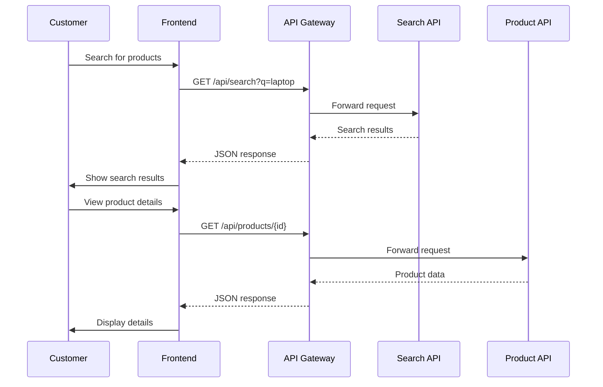
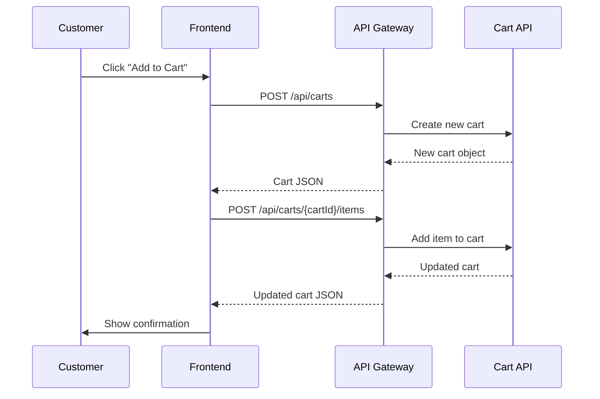
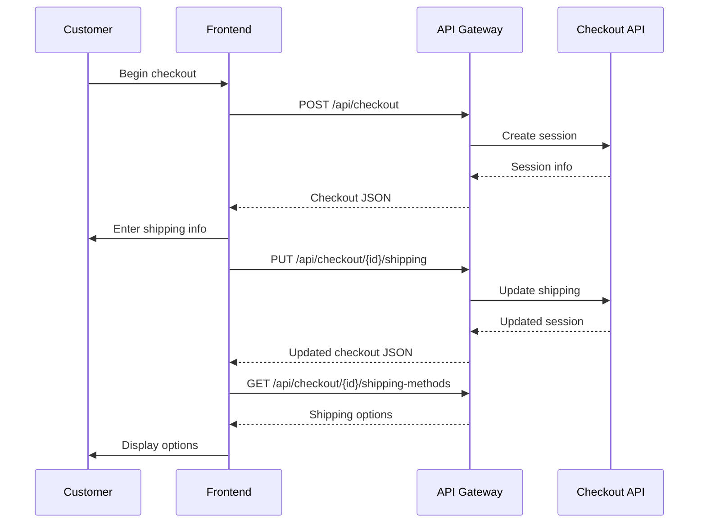
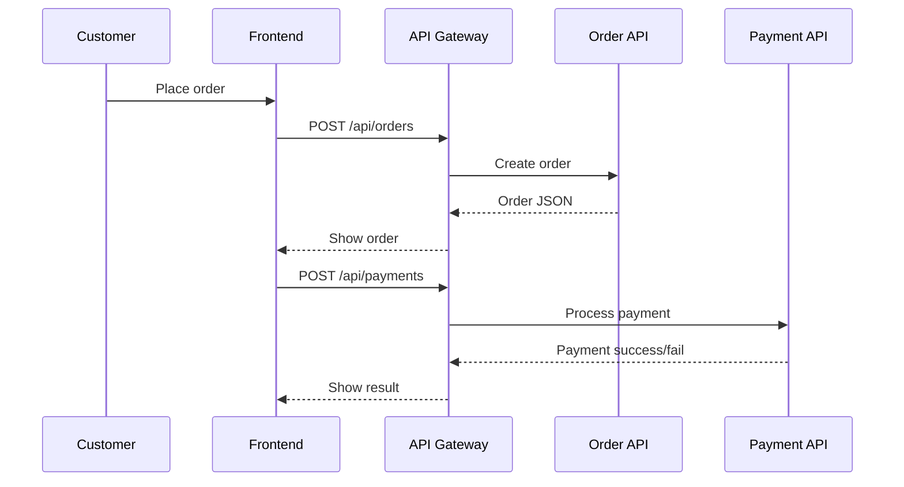
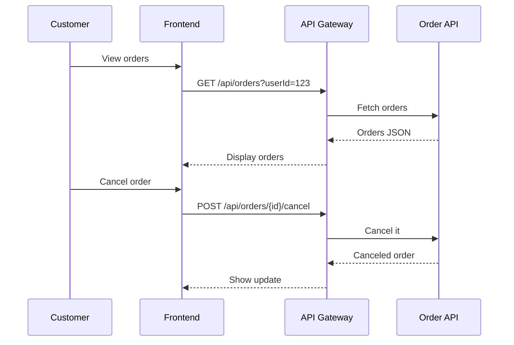

# 🛒 Kiosko FIUBA

Kiosko FIUBA is a modern e-commerce frontend application designed to provide a seamless shopping experience for users. Built with Next.js and React, it features a responsive, intuitive interface for browsing products, managing carts, and completing purchases.

---

## 📚 Table of Contents

- [Overview](#overview)
- [Features](#features)
- [Getting Started](#getting-started)
  - [Prerequisites](#prerequisites)
  - [Installation](#installation)
  - [Running the Application](#running-the-application)
- [Architecture](#architecture)
  - [Frontend Structure](#frontend-structure)
  - [Buying Process Flow](#buying-process-flow)
- [Technologies Used](#technologies-used)
- [API Integration](#api-integration)
- [State Management](#state-management)
- [Styling](#styling)
- [Testing](#testing)
- [Deployment](#deployment)
- [Contributing](#contributing)
- [License](#license)

---

## 🧭 Overview

Kiosko FIUBA is a frontend e-commerce app that connects to a microservices backend. It focuses on:

- Smooth product discovery ✅
- Shopping cart management 🛒
- Streamlined checkout 🔐
- Order management 📦

All crafted with performance and user experience in mind.

---

## ✨ Features

- 🔎 **Product Discovery**: Browse by category, search with filters, and view detailed product info
- 🛍️ **Shopping Cart**: Add/update/remove items and persist the cart across sessions
- 👤 **User Profiles**: Sign up, login, and manage addresses & payment methods
- 💳 **Checkout Process**: Simple checkout with shipping & payment steps
- 📦 **Order Management**: See past/current orders and cancel if needed
- 📱 **Responsive Design**: Looks great on mobile & desktop
- 🌐 **Localization**: Spanish 🇦🇷 + ARS support

---

## 🚀 Getting Started

### ✅ Prerequisites

- Node.js (v16+)
- npm or yarn
- Git

### 🧰 Installation

```bash
# Clone repo
git clone https://github.com/your-organization/kiosko-fiuba.git
cd kiosko-fiuba

# Install dependencies
npm install
# or
yarn install

# Environment config
cp .env.example .env.local
# and edit it:
NEXT_PUBLIC_API_URL=http://your-api-gateway-url
```

### ▶️ Running the Application

```bash
npm run dev
# or
yarn dev
```

Visit: [http://localhost:3000](http://localhost:3000)

---

## 🧱 Architecture

### 📁 Frontend Structure

```plaintext
/app        - Pages & layouts (Next.js App Router)
/components - UI components
/hooks      - Custom hooks
/context    - Global state providers
/services   - API clients & service logic
/types      - TypeScript types
/public     - Static assets
```

### 🛍️ Buying Process Flow

#### 1. 🧭 Product Discovery Phase



#### 2. 🛒 Cart Management Phase



#### 3. 💳 Checkout Phase



#### 4. 🧾 Order & Payment Phase



#### 5. 📦 Post-Purchase Phase



---

## 🛠️ Technologies Used

- **Framework**: Next.js 13+ (App Router)
- **UI Library**: React 18+
- **Styling**: Tailwind CSS
- **State Management**: Context API + SWR
- **Forms**: React Hook Form
- **Validation**: Zod
- **Icons**: Lucide React
- **Components**: shadcn/ui

---

## 🌐 API Integration

The app connects to a microservices backend via an API Gateway:

- 📦 **Product Microservice**: Product info, search, inventory
- 🛒 **Shopping Microservice**: Cart, checkout, shipping
- 💳 **Payment Hub**: Orders, payment processing, methods

Each service is abstracted via `/services/*` modules.

---

## 🧠 State Management

- 🧭 **Context API**: User auth, cart, theme
- 📦 **SWR**: Data fetching + caching
- 💾 **LocalStorage**: Persist cart ID, preferences

---

## 🎨 Styling

Tailwind CSS powers the UI with a utility-first approach:

- Responsive layouts
- Accessible components
- Dark mode support 🌙
- Consistent color & typography 🎨

---

## 🧪 Testing

- 🔬 **Unit Tests**: Components & logic
- 🧩 **Integration Tests**: Component interaction
- 🚀 **E2E Tests**: Full user flows

```bash
npm run test
# or
yarn test
```

---

## 🚀 Deployment

### ✅ Recommended: Vercel

```bash
npm run build
vercel --prod
```

### 💾 Static Export

```bash
npm run build
npm run export
```

---

## 🤝 Contributing

1. Fork the repo
2. Create a branch: `git checkout -b feature/amazing-feature`
3. Commit: `git commit -m 'feat: add amazing feature'`
4. Push: `git push origin feature/amazing-feature`
5. Open a PR 🚀
